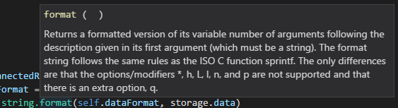
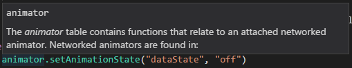
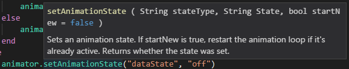

# Starbound LUA

This is a VS Code extension to add syntax highlighting and code completion for Starbound LUA to VS Code.

Currently it contains:
- Syntax Highlighting
- Code Completion

## Code Completion / Signature Help (Parameter Info)

## Hover Help

# LUA lib

# Starbound Types

# Starbound Functions

It comes with one color scheme:
- VSDark

## VSDark

