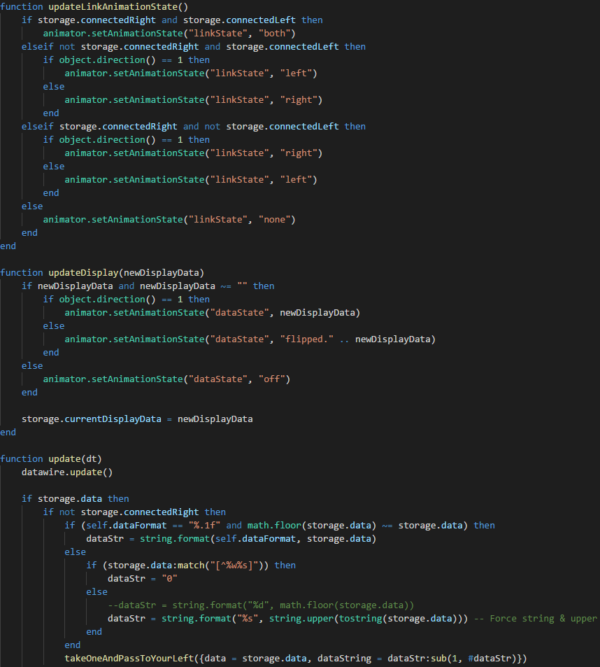

# Starbound LUA

This is a VS Code extension to add syntax highlighting and code completion for Starbound LUA to VS Code.

Currently it contains:
- Syntax Highlighting
- Code Completion

## Code Completion

It comes with one color scheme:
- VSDark

## VSDark

